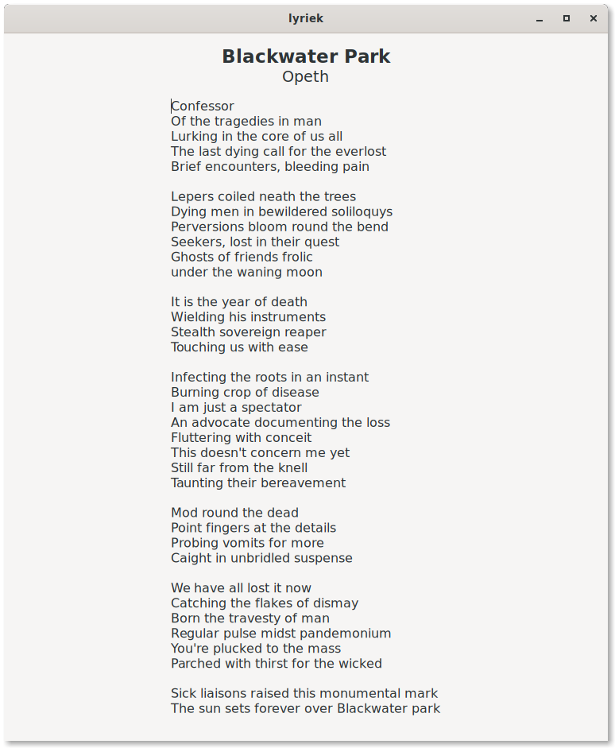

# Lyriek

A multi-threaded GTK 3 application for fetching the lyrics of the current playing song.



## Installation

### Arch Linux

```
yay -S lyriek
```

### Ubuntu

```
apt install libgtk-3-dev --no-install-recommends
cargo build --release
```
